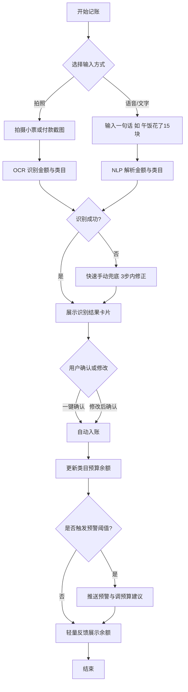
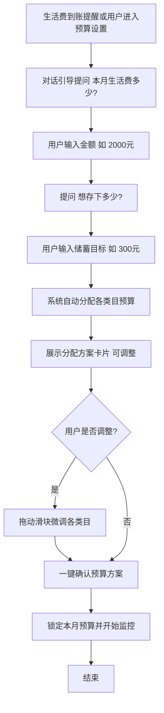
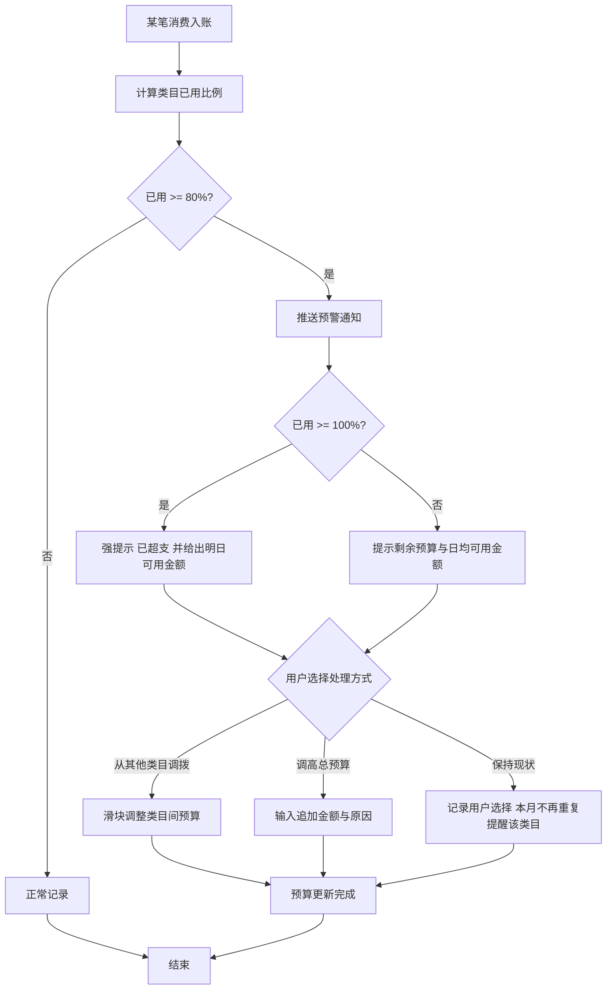

# 校园钱包 PRD 文档

## 1. 文档信息

版本号：1.0
创建日期：2026-09-11
状态：草稿

## 2. 产品概述

### 2.1 产品背景

大学生活费通常按月发放（家长按月转账或固定生活费），但大量学生缺乏财务规划意识与记账习惯，普遍存在两类典型困境：

1. **月初大手大脚、月底钱不够用**：月初生活费到账后消费无节制，月中才发现余额告急，月底只能靠泡面度日甚至向同学借钱，且事后完全说不清钱花到哪里去了。
2. **想存钱但总忍不住冲动消费**：有攒钱意愿（如攒钱买数码产品、旅行基金），但没有预算约束和消费提醒机制，面对奶茶、外卖、直播带货等冲动消费场景时毫无抵抗力，月底一看余额所剩无几。

市面上的记账产品（如随手记、鲨鱼记账）功能偏重、记账步骤繁琐（打开 App→选分类→输金额→备注），对大学生而言使用门槛和心理负担过高，导致“想记但坚持不下来”。本产品通过**极轻记账**（拍照/一句话语音即可完成记录）与**对话引导式**的预算管理，降低记账成本，帮助学生建立消费感知与预算意识。

### 2.2 产品目标

1. **把记账动作做到极轻**：支持拍照小票自动识别、一句话语音/文字输入自动解析金额与分类，将单次记账时间压缩到 5 秒以内，解决“记账太麻烦坚持不下来”的根本问题。
2. **月度预算自动分配与超支预警**：生活费到账后自动按类目（餐饮、社交、娱乐、学习等）分配预算，消费接近或超过阈值时主动推送预警，帮助学生从“月初潇洒月底吃土”转变为“心中有数、月底有余”。
3. 培养理财新手大学生的基础财务意识，长期形成消费可视化与理性消费习惯（假设：以连续 3 个月留存率 ≥40%、周记账 ≥10 次为成功指标）。

### 2.3 目标用户

- **月光族大学生**：18-24 岁在校本科生/研究生，生活费按月到账，消费随意、缺乏规划，月初消费冲动强，月底频繁陷入“吃土”状态；诉求是能直观看到钱花在哪里、月底能撑过去。
- **理财新手大学生**：刚接触个人财务管理的记账小白，有一定储蓄意愿，但缺乏预算概念和自控力，容易被种草消费；诉求是低门槛的预算工具和及时的消费提醒，帮助实现攒钱小目标。
- 共同特征：手机重度用户，习惯语音助手、拍照等轻交互；对复杂表格和手动填写容忍度极低；生活费来源单一（家长转账/兼职），金额通常在 1500-3000 元/月（假设）。

## 3. 需求详情

### 3.1 用户场景

场景 1：食堂扫码付款后随手记账
- 用户角色：月光族大学生小张
- 场景描述：中午在食堂吃完饭用微信支付了 15 元，过去用别的记账 App 要点七八下才能记一笔，早就放弃了。
- 用户行为：打开校园钱包，对着付款截图/小票拍一张照（或说一句“午饭花了15块”），系统自动识别金额、类目（餐饮）并完成记录。
- 预期结果：3-5 秒完成记账，App 给出一句轻量反馈（如“今日餐饮已花 35 元，还有预算 65 元”），用户无心理负担。

场景 2：月初生活费到账，设置本月预算
- 用户角色：理财新手大学生小李
- 场景描述：每月 1 号妈妈转账 2000 元生活费，小李想攒 300 元买演唱会门票，希望这个月不再月光。
- 用户行为：App 收到“生活费到账”提示（或用户手动输入），进入对话式引导：“这个月生活费多少？→ 想存多少？→ 我们帮把剩下的按餐饮/社交/娱乐/学习分配好了，可以调整哦”，小李微调后一键确认。
- 预期结果：预算自动分配完成，首页清晰展示各类目余额；月末小李成功攒下 300 元。

场景 3：月中预算吃紧收到预警
- 用户角色：月光族大学生小张
- 场景描述：月中 15 号，小张餐饮类预算已用掉 80%，但他还想点外卖。
- 用户行为：点外卖付款后，App 推送预警：“餐饮预算只剩 60 元了，剩余 15 天，建议每天控制在 4 元内，或者从娱乐预算调 50 元过来？”小张点击“从娱乐调 50 元”。
- 预期结果：预算灵活调整，超支风险被化解，小张对本月消费保持掌控感，月底不再借钱。

### 3.2 功能需求

| 功能编号 | 功能模块 | 功能描述 | 优先级 | 对应痛点 |
|---|---|---|---|---|
| F01 | 拍照记账 | 拍摄小票/付款截图，OCR 自动识别金额、商家、类目，用户确认或一键修正后入账 | P0 | 记账麻烦坚持不下来 |
| F02 | 语音/一句话记账 | 语音或文字输入“午饭花了15块”，NLP 解析金额与分类，自动入账并给出反馈 | P0 | 记账麻烦坚持不下来 |
| F03 | 对话式预算设置 | 生活费到账后通过对话引导设置总额、储蓄目标，自动按类目分配预算，支持手动微调 | P0 | 月初大手大脚、月底钱不够用 |
| F04 | 超支预警 | 类目预算达到 80%/100% 时推送预警，提供“调预算/停止消费建议”快捷操作 | P0 | 月底钱不够用、冲动消费 |
| F05 | 消费看板 | 首页展示本月总余额、各类目剩余预算、消费趋势图，数据可视化 | P1 | 说不清钱花哪里去了 |
| F06 | 储蓄目标（存钱罐） | 设置攒钱目标（金额+截止时间），自动从生活费划拨，展示进度 | P1 | 想存钱总忍不住冲动消费 |
| F07 | 冲动消费冷静期 | 单笔消费超过设定阈值（默认单类目日均预算 3 倍，假设）时弹窗提示“再想想”，可延迟 24 小时提醒 | P2 | 冲动消费 |
| F08 | 周报/月报 | 每周/每月生成消费报告，对话式总结（“这周比上周少花了 80 元，真棒”） | P2 | 缺乏消费复盘意识 |

### 3.3 非功能需求

| 类别 | 要求 |
|---|---|
| 性能 | 拍照/语音记账从输入到入账 ≤5 秒（含识别）；App 冷启动 ≤2 秒；预警推送延迟 ≤10 秒 |
| 准确性 | OCR/NLP 记账金额识别准确率 ≥95%（假设），识别失败时提供快速手动兜底（3 步内完成） |
| 安全 | 消费数据加密存储；不强制绑定银行卡/支付账户（纯记录工具，降低信任门槛）；支持本地+云端备份 |
| 兼容性 | iOS 14+ / Android 9+；适配主流手机屏幕 |
| 可用性 | 单手操作优先；无网络时支持本地记账、联网后同步 |
| 合规 | 遵守个人信息保护法，隐私政策清晰；不采集非必要个人信息 |

## 4. 功能流程

### 功能一：拍照/语音一键记账

### 功能二：对话式预算设置与自动分配

### 功能三：超支预警与预算调整

## 5. 数据需求

| 数据项 | 类型 | 来源 | 用途 |
|---|---|---|---|
| 账单记录（金额、类目、时间、备注） | 结构化 | 拍照 OCR / 语音 NLP / 手动 | 消费统计、看板、报告 |
| 月度预算方案（总额、类目分配、储蓄目标） | 结构化 | 用户设置/系统推荐 | 预算监控与预警 |
| 类目消耗进度 | 计算数据 | 账单+预算实时计算 | 预警触发、首页展示 |
| 小票/截图图片 | 非结构化 | 用户上传 | OCR 识别（识别后可选保留/删除） |
| 语音原始记录 | 音频/文本 | 用户输入 | NLP 解析后即转文本，音频不留存（假设） |
| 用户偏好（预警阈值、冷静期金额、常用类目） | 结构化 | 用户设置 | 个性化推荐与预警 |
| 周/月消费统计 | 计算数据 | 账单聚合 | 报告生成、习惯分析 |

## 6. 界面设计建议

- **首页（核心页）**：贯彻“对话引导式 + 一键自动记账”主线。顶部为本月总余额与剩余天数进度条；中部为对话流区域，助手以气泡形式反馈每笔记账结果与预算提醒；底部为悬浮的拍照/语音双按钮（大按钮、单手可达），点击即记。
- **记账过程**：识别结果以卡片气泡展示在对话流中，卡片上金额/类目可直接点击修改，确认按钮突出，整个过程不跳转页面。
- **预算页**：总额与储蓄目标置顶，各类目预算以横向胶囊/环形进度条展示，调整采用拖动滑块，操作即时生效。
- **看板页**：类目剩余预算用颜色（绿→黄→红）直观标识，消费趋势用简洁折线图。
- **整体风格**：年轻化、低压力——不出现“批评式”文案，预警用温和建议语气（“再想想哦”而非“你超支了！”）。

## 7. 技术考量

- **客户端**：Flutter/React Native 跨端开发（iOS + Android 双端，降低成本）。
- **OCR**：接入成熟 OCR 服务（如腾讯云/阿里云通用与票据识别 API），重点优化付款截图识别。
- **NLP 意图解析**：大模型 API 或自训练轻量意图解析模型，解析“一句话记账”中的金额、类目、时间。
- **语音识别**：系统级 ASR（iOS Speech / Android Speech）+ 云端 ASR 兜底。
- **后端**：预算计算与预警需低延迟，采用消息推送（APNs/厂商通道）；数据同步支持离线优先（本地 SQLite + 云端同步）。
- **数据安全**：传输 HTTPS、存储 AES 加密、敏感图片可选仅本地保留。

## 8. 项目里程碑（建议）

| 阶段 | 时间周期 | 交付内容 | 目标 |
|---|---|---|---|
| 阶段一：MVP | 第 1-6 周 | 拍照/语音记账、对话式预算设置、超支预警 | 验证“极轻记账”核心价值，完成 200 名种子用户内测（假设） |
| 阶段二：完善 | 第 7-12 周 | 消费看板、储蓄目标（存钱罐）、手动兜底优化 | 提升留存与使用频次，周记账 ≥10 次 |
| 阶段三：增长 | 第 13-20 周 | 周/月报、冲动消费冷静期、体验优化 | 校园推广，验证 3 个月留存 ≥40% |

## 9. 风险与假设

**风险**
- OCR/NLP 识别准确率不达预期（如付款截图样式繁多），导致用户仍需手动修正，削弱“极轻”卖点 → 需持续积累校园高频消费场景样本优化模型，并提供极简手动兜底。
- 预警过于频繁或语气不当引发用户反感、卸载 → 控制预警频次与文案语气，提供提醒偏好设置。
- 用户记账行为衰减，长期留存低 → 通过对话反馈、周报激励、存钱目标进度等正向激励维持习惯。
- 数据安全与隐私信任问题 → 不强制绑定支付账户，明确隐私政策。

**假设**
- 目标用户月生活费约 1500-3000 元，以家长月转账为主要来源。
- 用户能接受“纯记录工具”定位（不与银行/支付账户直连）。
- 大模型/NLP 服务成本在可控范围内（单次记账解析成本可接受）。
- 识别准确率目标 ≥95% 可通过样本积累逐步达成。

## 10. 附录

- 竞品参考：鲨鱼记账、随手记、一羽记账（侧重其记账步骤数与新手引导的对比）。
- 术语说明：
  - 极轻记账：单次记账操作 ≤2 次点击/1 句话，总耗时 ≤5 秒。
  - 对话引导式：以助手对话气泡替代传统表单，逐步引导用户完成预算设置。
- 后续迭代方向（假设）：校园场景拓展（拼单记账、室友公共支出分摊）、账单导入（支付宝/微信账单截图批量识别）。